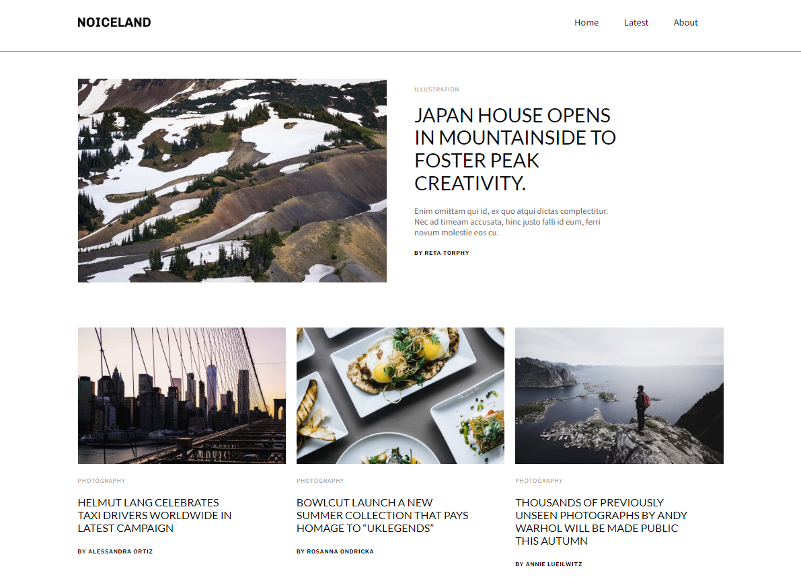

# Noiceland Portfolio Page #

Сделано в рамках курса IT Academy.

Сайт написан на HTML/JS/CSS, без использования препроцессоров и сборки проекта.

[Github Pages](https://m12d15.github.io/page-noiceland/)

[Исходный макет на Figma](https://www.figma.com/file/10NCr58WRzeNLOLwZ56uPY/Noiceland-%2B?type=design&node-id=0-1&t=2I5q0bDEio14XD12-0)